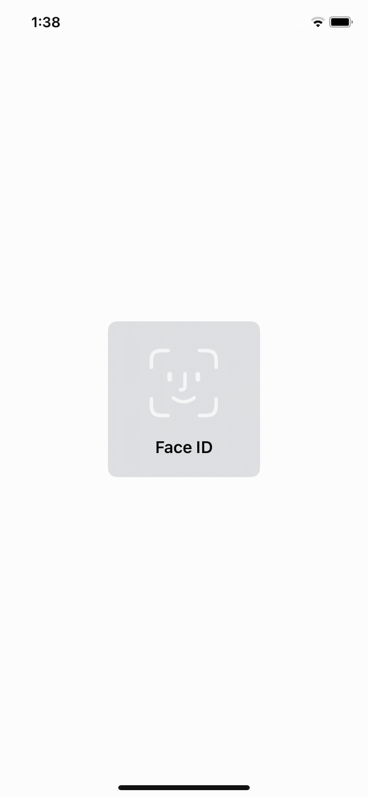
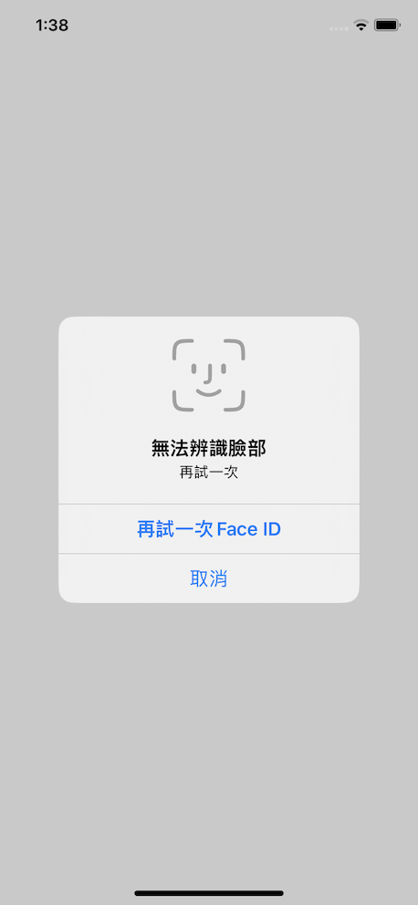
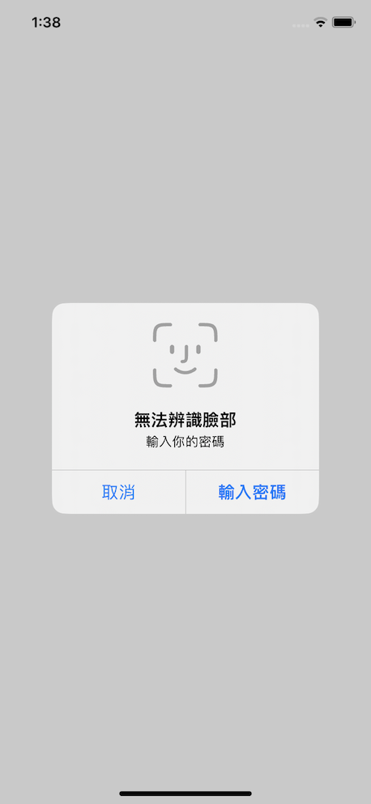

# ```MyAuthenticator```

## Overview
透過指紋辨識或FaceID進行生物辨識

## Static Methods
|Method|Description|
|---|---|
|[+ (void)authenticator:(void(^)(BOOL success, NSString  * _Nullable error))result](#authenticator)|進行生物辨識|

## Detail
### authenticator
|return type|description|
|---|---|
|void||

|param|type|description|
|---|---|---|
|result|(void(^)(BOOL success, NSString  * _Nullable error))|辨識成功時success回傳YES;辨識失敗時success回傳NO,並且帶回錯誤訊息|

Example
```objectivec=
#import <MyTools/MyAuthenticator.h>

[MyAuthenticator authenticator:^(BOOL success, NSString * _Nullable error) {
    if(success){
        // 辨識成功
    }else{
        // 辨識失敗
        NSLog(@"error: %@", error);
    }
}];

```



