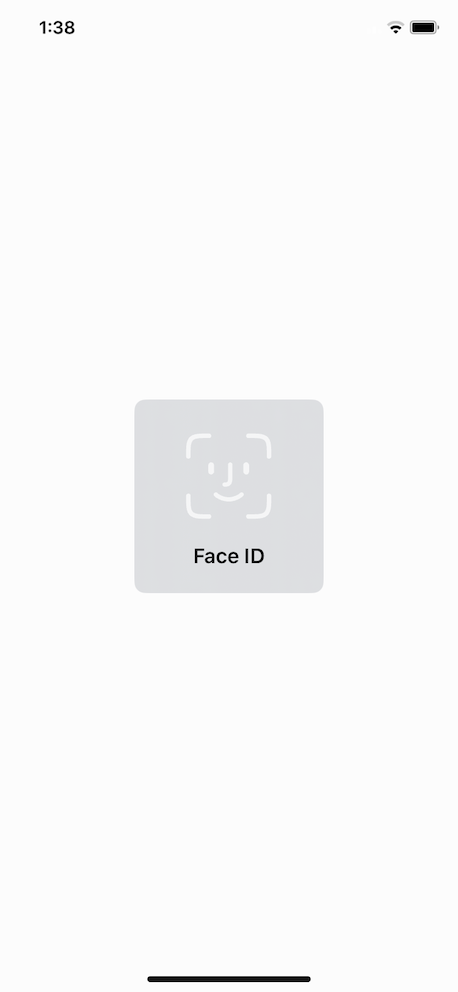

# ```MyAuthenticator```

## Overview
透過指紋辨識或FaceID進行生物辨識

## Notice
1. 加入 "Privacy - Face ID Usage Description" 至 Info.plist
2. import <MyTools/MyAuthenticator.h>

## Static Method
|Method|Description|
|---|---|
|[+ (void)authenticator:(void(^)(BOOL success, NSString  * _Nullable error))result](#authenticator)|進行生物辨識|

### Detail
#### authenticator
|Param|Type|Description|
|---|---|---|
|result|(void(^)(BOOL success, NSString  * _Nullable error))|辨識成功時success回傳YES;辨識失敗時success回傳NO,並且帶回錯誤訊息|

## Example
```objectivec=
//  ViewController.m

#import "ViewController.h"
#import <MyTools/MyAuthenticator.h>

@implementation ViewController

- (void)viewDidLoad {
    [super viewDidLoad];
    
}

- (void)viewDidAppear:(BOOL)animated{
    [super viewDidAppear:animated];
    
    [MyAuthenticator authenticator:^(BOOL success, NSString * _Nullable error) {
        if(success){
            // 辨識成功
        }else{
            // 辨識失敗
            NSLog(@"error: %@", error);
        }
    }];
}

@end
```
\
\

