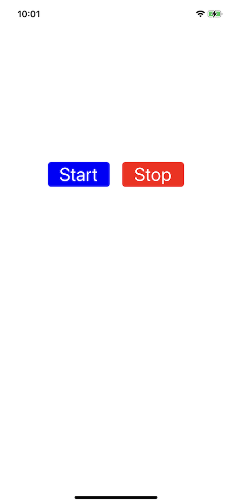

# ```MySpeechView```

## Overview
透過語音識別框架進行語音辨識 (UI版)

## Notice
1. 加入 "Privacy - Microphone Usage Description" 至 Info.plist
2. 加入 "Privacy - Speech Recognition Usage Description" 至 Info.plist


## Example
```objectivec=
//  ViewController.m

#import "ViewController.h"
#import <MyTools/MySpeechView.h>
@interface ViewController()
@property (strong, nonatomic) MySpeechView *mySpeechView;
@end

@implementation ViewController

- (void)viewDidLoad {
    [super viewDidLoad];
    
    self.mySpeechView = [[MySpeechView alloc] initWithFrame:self.view.frame];
    [self.view addSubview:self.mySpeechView];
}

@end
```



